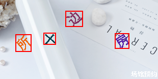
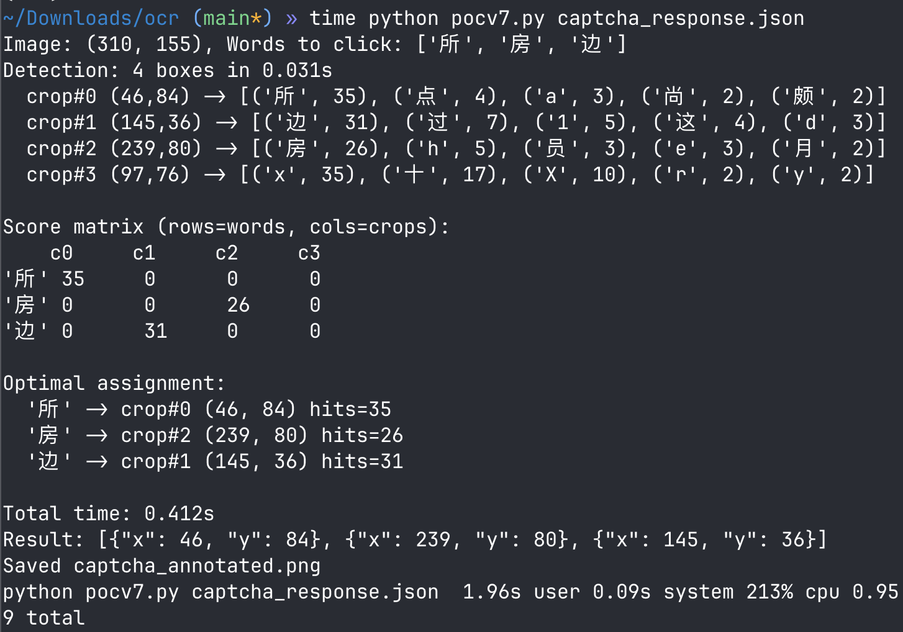

# aj-captcha clickWord OCR POC

Solve aj-captcha `clickWord` type CAPTCHAs using ddddocr detection + multi-rotation classification.
**It should be done around 1 second.** 

## Results





## Setup

```bash
# Requires Python 3.11-3.12 (ddddocr doesn't support 3.13+)
python -m venv .venv
source .venv/bin/activate
pip install -r requirements.txt

# uv
# 1) create a virtual environment
uv venv --python 3.12
# 2) activate it
source .venv/bin/activate       # macOS / Linux
# or
.venv\Scripts\activate          # Windows PowerShell
# 3) install dependencies from requirements.txt
uv pip install -r requirements.txt

# Or just (Recommended)
uv sync
```

## Usage

1. Save the `/captcha/get` JSON response to a file:

   `Source`: The json response of  `get?captchaType....` request.
   

   

```bash
# Example: capture from browser DevTools, copy response, save as:
cat > captcha.json
```

2. Run:

```bash
python pocv7.py captcha.json

# with uv
uv run python pocv7.py captcha.json
```

3. Check `captcha_annotated.png` to visually verify detection boxes.

## How it works

1. **Detection**: ddddocr (`det=True`) finds all character bounding boxes in the CAPTCHA image.
2. **Classification**: Each detected crop is expanded into **55 variants** (11 rotation angles × 5 preprocessing methods: original, grayscale+autocontrast, binary at 2 thresholds, inverted at 2 thresholds). All variants are classified by ddddocr, and per-character hit counts are accumulated.
3. **Score matrix**: A `words × crops` matrix is built, where each cell is the hit count of that word in that crop's classification results.
4. **Optimal assignment**: The [Hungarian algorithm](https://en.wikipedia.org/wiki/Hungarian_algorithm) (`scipy.optimize.linear_sum_assignment`) finds the globally optimal 1-to-1 word-to-crop matching that maximizes total score. This avoids greedy conflicts where two crops compete for the same word.
5. **Output**: Click coordinates (center of matched bounding boxes), ordered by `wordList`.
